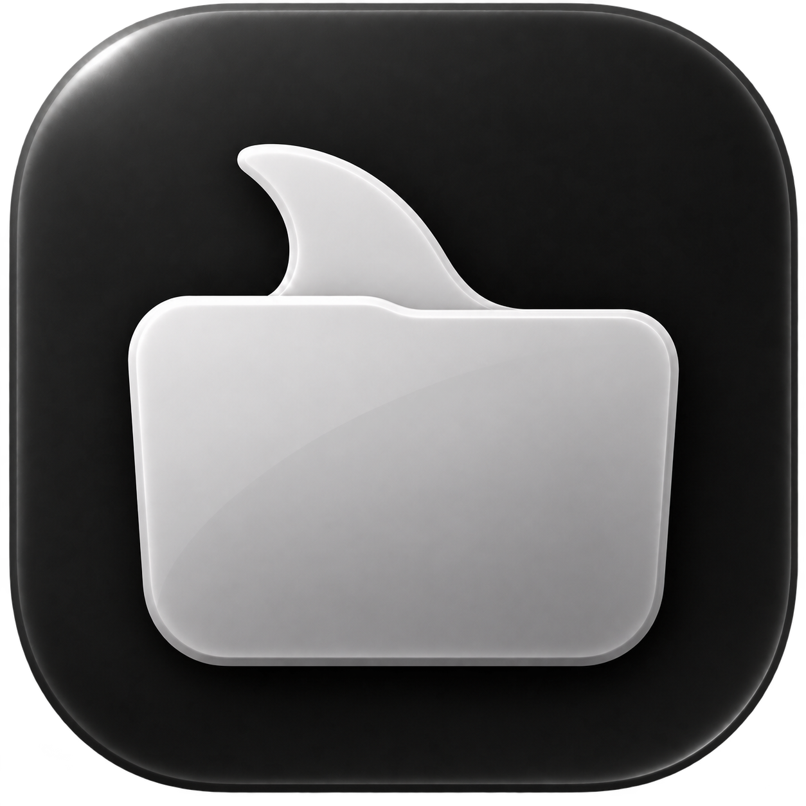

<p align="center">
  
</p>

# Orka

Orka is a Finder-style file manager for macOS. It has Chrome-style tabs,
multiple windows, remote connections over SFTP, S3, FTP, SMB, NFS, ADLS
Gen2, Google Drive, Dropbox, and RSync over SSH, a Trash, and a
GitKraken-style git graph panel with per-file status badges.

The app is a SwiftUI shell over a Rust core. The Rust core owns the
filesystem model, the operations engine (copy, move, trash, archive,
undo/redo), and the remote backends. The Swift app talks to it through a
UniFFI-generated bridge.

## Requirements

- macOS 26
- Xcode (a full install, not only the Command Line Tools)
- The Rust toolchain (`rustup`, stable)
- [XcodeGen](https://github.com/yonaskolb/XcodeGen) (`brew install xcodegen`)
- [`just`](https://github.com/casey/just) (`brew install just`)

## Build

```sh
just release
```

This builds the Rust core in release mode, then builds the app with
`xcodebuild`. `just` points `DEVELOPER_DIR` at a full Xcode install, since
`xcodebuild` needs one.

Other recipes:

```sh
just debug    # Rust release build + Debug app build
just dist     # release build, copied to dist/Orka.app
just run      # dist, then relaunch the app from dist/
just test     # Rust and Swift unit tests
just clean    # remove build products (keeps dist/)
```

The Xcode project, `app/Orka.xcodeproj`, is generated by XcodeGen from
`app/project.yml` and is not checked in. Run `xcodegen` inside `app/`
after changing `project.yml`, or after cloning the repository, before
opening the project in Xcode:

```sh
cd app && xcodegen
```

The generated Swift bindings under `app/Generated/` are also not checked
in. `scripts/build-rust.sh` (run automatically by the `just` recipes
above) builds `liborka_ffi` and regenerates them from the same crate.

## Full Disk Access

Orka reads the Trash on launch to probe for Full Disk Access. Until macOS
grants it, the app shows a gate screen instead of the file browser, with
a button that opens System Settings > Privacy & Security > Full Disk
Access. Add Orka there and turn it on; the gate screen closes on its own
once access is granted.

## Project layout

```
app/          SwiftUI app. app/project.yml is the XcodeGen source of
              truth; app/Orka.xcodeproj is generated from it.
crates/       Rust workspace.
  orka-core/  Filesystem model, operations engine, remote backends,
              search, git integration. Pure Rust, no UI.
  orka-ffi/   UniFFI crate that exposes orka-core to Swift.
scripts/      Build helpers (scripts/build-rust.sh).
justfile      Build, run, and test recipes.
```

## Tests

```sh
just test
```

runs the Rust workspace tests (`cargo test --workspace`) and the Swift
unit tests (`OrkaTests`, which cover pure logic such as `OrkaPath` and
build without the Rust dylib).

## Branches

- `main` is the primary branch.
- `tab-dragging` carries an in-progress browser-style tab-drag feature.
  It is not yet merged.
